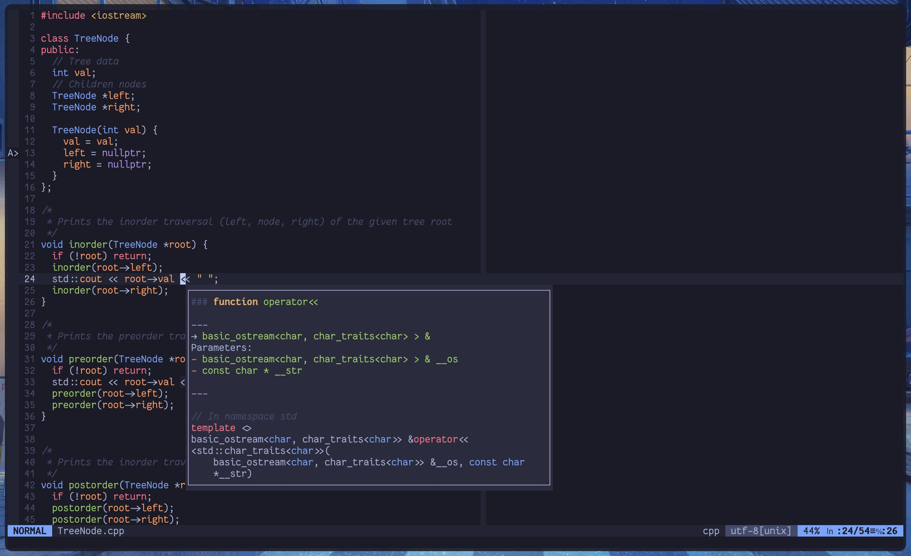

# kickstart.vim



### Introduction

Kickstart.vim is a Vimscript version of [Kickstart.nvim](https://github.com/nvim-lua/kickstart.nvim).
Like Kickstart.nvim, Kickstart.vim strives to be:

> A starting point for ~~Neovim~~ Vim that is:
>
> * Small
> * Single-file ~~(with examples of moving to multi-file)~~
> * Documented
> * Modular

### Installation

> [!NOTE]
> I highly recommend you to [fork](https://docs.github.com/en/get-started/quickstart/fork-a-repo) this repo so that you can manage your own configuration

Option #1: Copying the contents of the `.vimrc`

**Option #2: Creating a symbolic link**

This is an easy way to manage your Vimrc with Git as well as other configuration files.

0. Backup your existing `.vimrc` (e.g., `mv ~/.vimrc ~/.old-vimrc.bak`)
1. clone the repository in your home directory
    ```bash
    # Replace `theopn/kickstart.vim` with `your-username/forked-repository-name` if you made a fork
    git clone https://github.com/theopn/kickstart.vim.git ~/kickstart.vim
    ```
2. Create a symbolic link between `~/kickstart.vim/.vimrc` and `~/.vimrc`
    ```bash
    # Make sure you have backed up existing .vimrc
    # The force flag (-f) will overwrite the existing file
    ln -sf ~/kickstart.vim/.vimrc ~/.vimrc
    ```
3. Now whenever you open `~/.vimrc`, you are opening `~/kickstart.vim/.vimrc`.
    Since `kickstart.vim` is a Git repository, you can easily manage changes you made to your `.vimrc` across multiple devices.

### Post Installation

Run the following command and then you are ready to go!

```bash
vim +PlugInstall +qa
```

### Changes from Kickstart.nvim

kickstart.vim:

- is written in Vimscript (:surprised Pikachu face:) and designed for Vim >= 0.8
- **enables some settings enabled by default in Neovim (e.g., autoindent, syntax)** on the top of kickstart.nvim settings
- uses Vim alternative for the following plugins
    - lazy.nvim -> vim-plug
    - which-key.nvim -> vim-which-key
    - gitsigns.nvim -> vim-gitgutter
    - onedark.nvim -> onedark.vim
    - lualine.nvim -> vim-airline
    - indent-blankline -> indentLine
    - Comment.nvim -> vim-commentary
    - telescope.nvim -> fzf & fzf.vim
- uses **SuperTab** in lieu of nvim-cmp
- disables `undofile` by default, but the instructions for changing `undodir` and enabling `undofile` are included
- does not provide an alternative for:
    - highlight on yank
    - **nvim-treesitter**
    - **Neovim diagnostics and LSP**
    - I considered using coc.nvim, but it requires external dependencies and user configuration not suitable for the goal of kickstart.vim.
        I am open to creating a branch/separate version of kickstart.vim with coc.nvim support
- omits keybindings for some Telescope features with no FZF alternatives (`grep_string`, `live_grep`, `diagnostics`, and `resume`)

